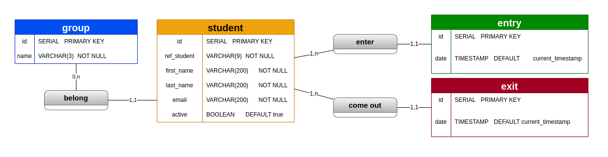
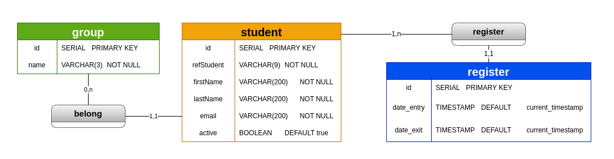

# Spring Boot Project (JDBC)
### Project for Examen Final PROG2
This repository contain the project who have them managening absence in school.
For create web server (REST API) using JDBC to connect to database.
<br/>

## Database Model
### Last version

### First version


<br/>
<hr/>

### Require
This project use and you need if you would like clone that :

-   Java version 17.0 or higher
-   PostgreSQL 14 or higher
-   Apache Maven 1.8 or higher

### Installation
If you have a IDE, just run this app on Server class `Server.java`

Or run app on directory ``Server`` execute command following :

```sh
$ cd Server
$ mvn run install
```
