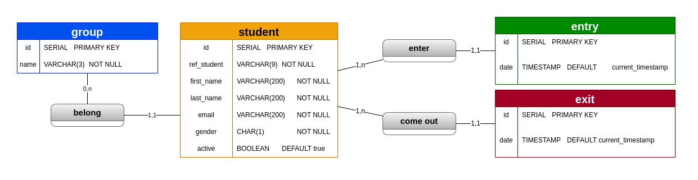

# Spring Boot Project (JDBC)
### Project for Examen Final PROG2
This repository contain the project who managening absence in school.
For create web server (REST API) using JDBC to connect to database.
<br/>

## MCD



<br/>
<hr/>

### Require
This project use and you need if you would like clone them :

-   Java version 17.0 or higher
-   PostgreSQL 14 or higher
-   Apache Maven 1.8 or higher

### Installation
Befor all, you should need execute `data.sql`  ( in ``/Server/src/main/resources/data.sql``)

For run this app change variable in `/Server/src/main/resources/application.properties`

    -    DB_URL => jdbc:postgresql://localhost:5432/{{database_name}}
    -    DB_USERNAME => {{user_name_of_postgresql}}
    -    DB_PASSWORD => {{password_of_postgresql}}


Or run app on directory ``Server`` execute following command  :

```sh
$ cd Server
$ mvn install
$ mvn spring-boot:run
```
